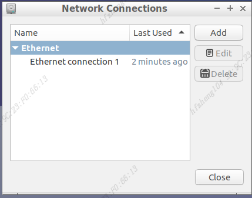
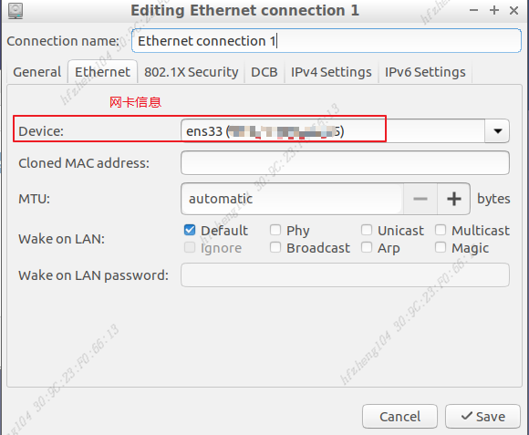
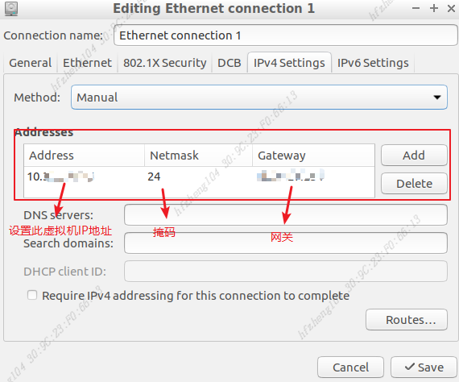
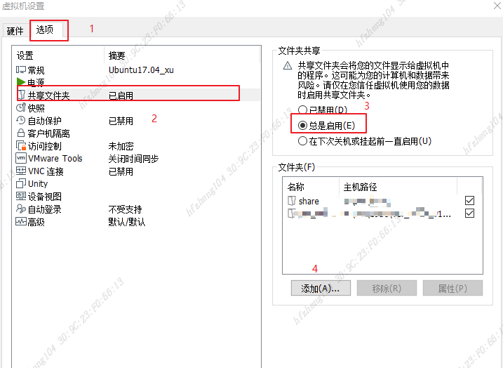

移植同事的Ubuntu时遇到了一些问题：网络连通问题和启动问题，故记录问题并记录解决方法

#### 网络问题

问题描述：移植了编译环境Ubuntu17.04虚拟机后出现与本机的网络无法互通

解决方案：由于是移植，因此将他人的配置也同时移植了，网络配置等也移植了，可能网卡等硬件设置不一样，故会出问题



1、因此需要查看本虚拟机网络的信息：

```shell
ifconfig
```

2、设置网络：



2、设置IP地址



重启虚拟机可以连通主机

#### 移植共享文件夹问题

问题描述：在移植他人虚拟机时，别人设置的共享文件夹也同时移植，第一次启动虚拟机成功，后续启动虚拟机报错 :failed to mount/mnt/hgfs,并无法进入图形界面

解决方案：由于移植过来的共享文件夹本机不存在，因此会报错：mnt/hgfs此文件夹为共享文件夹，因此需要修改共享文件夹为本机存在的文件夹



此时再重启虚拟机，虚拟机正常启动，并进入图形界面